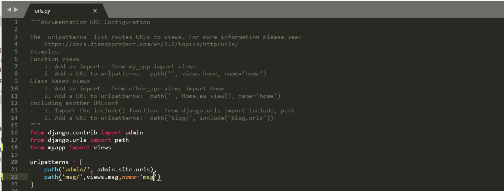
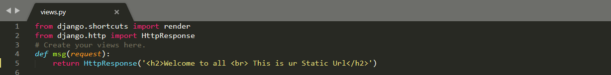
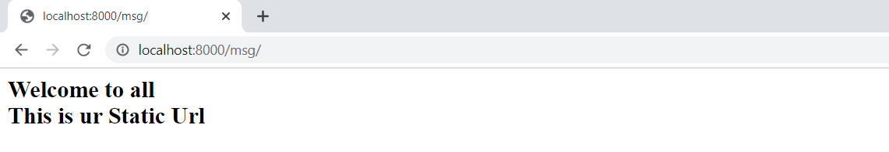

## Django Url Mapping
### What is a URL?

 * A URL is a web address. You can see a URL every time you visit a website – it is visible in your browser's address bar.(Yes!     127.0.0.1:8000 is a URL! And localhost:8000 is also a URL! And https://github.com/ is also a URL! )
 
 
 * Every page on the Internet needs its own URL. This way your application knows what it should show to a user.In Django, we use something called URL configuration.URL configuration is a set of patterns that Django will try to match the requested URL to find the correct view.

------------------------------------------

### Creating a Django Project & Application!
#### django installation
* Whether you are on Windows or Linux, just get a terminal or a cmd prompt,then use this code −

```
    pip install django
           (or)
    pip install django == 2.2.7
 ```
* After installing Django, you need to create a project  using django


#### Create a Project
* Whether you are on Windows or Linux, just get a terminal or a cmd prompt and navigate to the place you want your project to be created, then use this code −

````
$ django-admin startproject myproject
````


* Next, create an application using manage.py

#### Create an Application
* We assume you are in your project folder. In our main “myproject” folder, the same folder then manage.py −

````
$ python manage.py startapp myapp
````

#### Get the Project to Know About Your Application
* At this stage we have our "myapp" application, now we need to register it with our Django project "myproject". To do so, update INSTALLED_APPS tuple in the settings.py file of your project (add your app name) −

````
# Application definition

INSTALLED_APPS = [
    'django.contrib.admin',
    'django.contrib.auth',
    'django.contrib.contenttypes',
    'django.contrib.sessions',
    'django.contrib.messages',
    'django.contrib.staticfiles',
    'myapp',
]
````


------------------------------------------

 ### How do URLs work in Django?
  * Let's open up the myproject/urls.py file in your code editor like SublimeTool and see what it looks like:
  
  
  * As you can see, Django has already put something here for us.
  * We have only one url in myproject/urls.py that is **The admin URL** and that is for admin stuff.
  
   
 ------------------------------------------
 ### Types of URLs?
 #### We have 2 types Urls:
    1. Static Urls 
    2. Dynamic Urls
             
  ------------------------------------------
 ### Your first Django URL!
 * We can add our first URL pattern:
     * In myproject/urls.py for creating url we will use path function
     * In myproject/urls.py ,we have to import views from myapp, for that add this line in urls.py
  ````   
  from myapp import views
  ```` 
  * It looks like(myproject/urls.py):
   
   
   ------------------------------------------
   
  ### Configuring the Static URL:
  **`In Urls.py:`adding Static msg url path**
  * for that path we will give different values like:
  
         path('urlname/',views.funtionname,name='nameoftheurl'),
  * example:
  ````
            path('msg/',views.msg,name='msg'),
   ````
  * It looks like(myproject/urls.py):

   
   
   **`In views.py: importing HttpResponse and adding msg function`**
   * In views.py, we have to import HttpResponse, for that add this line in views.py
   
           
            from django.http import HttpResponse
            
   * In views.py we have add a function, with name we used in urls.py that is **msg**
   
   ```
               def msg(request):
                   return HttpResponse('Welcome to all <br> This is ur Static Url')
   ```
   
   > NOTE: In this function, request is a default parameter,we can't change that.
   
   * It looks like(myapp/views.py):
   
   
   **Run Project:**
   
   * save the changes  and start server using **python manage.py runserver**
   *  Then open chrome:
   
    localhost:8000/url
   * example:
      
             localhost:8000/msg
             
   **OutPut for Static Url:**
   * Then we get OUTPUT it looks like:
   

 ------------------------------------------
### Configuring the Dynamic URL:

**`for string:`**
  **`In Urls.py:`adding Dynamic string hello url path**
  * for that path we will give different values like:
  
         path('urlname/',views.funtionname,name='nameoftheurl'),
  * example:
  ````
            path('hello/',views.hello,name='hello'),
   ````
  * It looks like(myproject/urls.py):

   
   
   **`In views.py: importing HttpResponse and adding hello function`**
   * In views.py, we have to import HttpResponse, for that add this line in views.py
   
           
            from django.http import HttpResponse
            
   * In views.py we have add a function, with name we used in urls.py that is **hello**
   
   ```
               def hello(request,name):
                   return HttpResponse(<center><h2>Hi '+name+'<br>Welcome to Dynamic String Url</h2></center>)
   ```
   
   > NOTE: In this function, request is a default parameter,we can't change that.
   
   >  NOTE: Remember that in url what u taken as string name, that only passed in this function as a second parameter,it's better                to maintain samename in urls and views(inside function) also.     
        
   
   * It looks like(myapp/views.py):
   
   
   **Run Project:**
   
   * save the changes  and start server using **python manage.py runserver**
   *  Then open chrome:
   
    localhost:8000/url
   * example:
      
             localhost:8000/msg
             
   **OutPut for Dynamic String Url:**
   * Then we get OUTPUT it looks like:
   

---------------------------------------


  ### Configuring the Dynamic URL: 
  
   **`for string:`**

   **`In Urls.py: adding string dynamic hello url path`**
        * for that path we will give different values like:
            ````
              path('urlname/<str:name>',views.funtionname,name='nameoftheurl'),
              ````
        * example: 
             ````
              path('hello/<str:name>',views.hello,name='hello'),
             ````
        * It looks like(myproject/urls.py):
               
      
   **`In Views.py: importing HttpResponse and add hello function for string `**
   
          * In views.py, we have to import HttpResponse for that add this line in views.py
            ````
            from django.http import HttpResponse
            ````
          * In views.py we have add a function, with name we used in urls.py that is **hello** 
             ````
             def hello(request,name):
                 return HttpResponse(<center><h2>Hi '+name+'<br>Welcome to Dynamic String Url</h2></center>)
              ````   
        >  NOTE: Remember that in url what u taken as string name, that only passed in this function as a second parameter,it's better                to maintain samename in urls and views(inside function) also.     
        >  NOTE: In this function, request is a default parameter,we can't change that.  
        * It looks like(myapp/views.py):
         
        **Run Project:** 
        * Save the changes  and start server using **python manage.py runserver**
        * Then open chrome **localhost:8000/url/name**
        * example:
          ````
            localhost:8000/hello/Apssdc
            ````
        **OutPut for Dynamic String Url:**         
        * Then we get OUTPUT it looks like:
        
    
 -------------------------------------
 **`for integer:`**

   **`In Urls.py: adding integer dynamic hello url path`**
        * for that path we will give different values like:
            ````
              path('urlname/<int:id>',views.funtionname,name='nameoftheurl'),
              ````
        * example: 
             ````
              path('rollno/<int:id>',views.rollno,name='rollno'),
             ````
        * It looks like(myproject/urls.py):
               
      
   **`In Views.py:importing HttpResponse and add hello function for string and rollno function for integer `**
          * In views.py, we have to import HttpResponse for that add this line in views.py
            ````
            from django.http import HttpResponse
            ````
          * In views.py we have add a function, with name we used in urls.py that is **hello** 
             ````
             def hello(request,name):
                 return HttpResponse(<center><h2>Hi '+name+'<br>Welcome to Dynamic String Url</h2></center>)
              ````   
        >  NOTE: Remember that in url what u taken as string name, that only passed in this function as a second parameter,it's better                to maintain samename in urls and views(inside function) also.     
        >  NOTE: In this function, request is a default parameter,we can't change that.  
        * It looks like(myapp/views.py):
         
        **Run Project:** 
        * Save the changes  and start server using **python manage.py runserver**
        * Then open chrome **localhost:8000/url/name**
        * example:
          ````
            localhost:8000/hello/Apssdc
            ````
        **OutPut for Dynamic String Url:**         
        * Then we get OUTPUT it looks like:
        
 
 
 
 
   **`for integer:`**
          
             path('urlname/<int:id>',views.funtionname,name='nameoftheurl'),
  
  path('rollno/<int:id>',views.rollno,name='rollno'),--------->integer
 **`for Integer:`**

             def rollno(request,id):
                 return HttpResponse(<center><h2>Hello {} <br>Welcome to Dynamic Integer Url</h2></center>'.format(id))
                 
 > NOTE:  Remember that in url what u taken as string name, that only passed in this function as a second parameter,it's better to maintain samename in urls and views(inside function) also. 
    
 > NOTE: In this function, request is a default parameter,we can't change that.
   
 * It looks like(myapp/views.py):
   
   
   **Run Project:**
   
   * Save the changes  and start server using **python manage.py runserver**
   * Then open chrome **localhost:8000/url/name**
   * example:
   
            localhost:8000/rollno/528
   **OutPut for Dynamic Integer Url:**         
   * Then we get OUTPUT it looks like:
   
   
------------------------------------------

