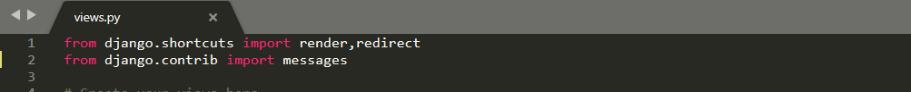

## Django Messages Creation:
* In Django Messages is a module for generating alerts.
* The Django web frameworks comes with a messaging system that allows us to store messages that we can check for on each page load. If there are some messages, we can display them to the user. 
* In any web application, we need to display notification messages to the end user after processing a form or some other types of his requests.
* we'd like to be able to quickly inform the user of errors with their form, or alert them to the success of logging in.
---------------------------
### Use of Messages?
*  If there is something users hate more than slow applications, it is applications that does not communicate with them.
      * The user clicks in a save button.
      * Nothing happens.
      * So, did it save the data or not?
      * User reaction after a couple of (mili)seconds: *Click!* *Click!* *Click!* *Click!*,
* So this type problems can be rectified using thisrrrr Messages.
--------------------------      
### Types of Messages:

     1. messages.success
     2. messages.info
     3. messages.warning
     4. messages.error
     5. messages.debug
-------------------------

### Message levels:
**Constant** |	**Purpose**
---|---
DEBUG |	Development-related messages that will be ignored (or removed) in a production deployment
INFO |	Informational messages for the user
SUCCESS |	An action was successful
WARNING |	A failure did not occur but may be imminent
ERROR |	An action was not successful or some other failure occurred

----------------------------------
### How to create messages:
   1. messages.success:
        * example:
        
                 messages.success(request,'ur record added successfully')
   2. messages.info:
        * example:
        
                 messages.success(request,'you can add one more record now')
   3. messages.warning:
        * example:
        
                 messages.success(request,'Your account expires in three days.')
   4. messages.error:
        * example:
        
                 messages.success(request,'Document Deleted')
   5. messages.debug:
        * example:
        
                 messages.success(request, '%s SQL statements were executed.' % count)
                 
 ---------------------------                
### Configuration (or) Accessing Messages:
* By default, a brand new Django project already comes with the messages framework installed.
* So we just import that messages,for that add this line in **myproject/views.py**

      from django.contrib import messages
* Based on Message, You have to choose which message type you have to use.
* It looks like(myproject/views.py):

### Procedure for to show message in Html file:
````

     
          <h2>{{msg}}</h2>
     

````
> Using **** , it checks there is any messages are not

> Using **** ,If there is morethan one message then show all messages,otherwise there is a single message show that one.

