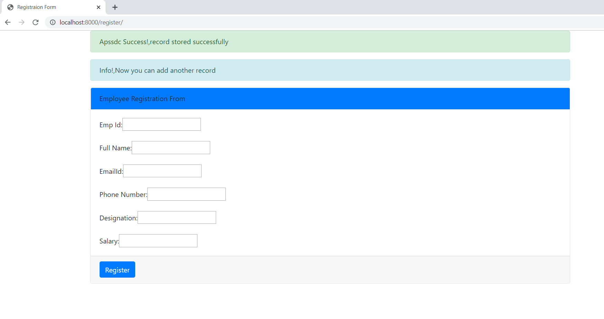

## Django Messages Creation:
### What is Django Messages:
* In Django Messages is a module for generating alerts.
* The Django web frameworks comes with a messaging system that allows us to store messages that we can check for on each page load. If there are some messages, we can display them to the user. 
* In any web application, we need to display notification messages to the end user after processing a form or some other types of his requests.
* we'd like to be able to quickly inform the user of errors with their form, or alert them to the success of logging in.
---------------------------
### Use of Messages?
*  If there is something users hate more than slow applications, it is applications that does not communicate with them.
      * The user clicks in a save button.
      * Nothing happens.
      * So, did it save the data or not?
      * User reaction after a couple of (mili)seconds: *Click!* *Click!* *Click!* *Click!*,
* So this type problems can be rectified using these Messages.
--------------------------      
### Types of Messages:

     1. messages.success
     2. messages.info
     3. messages.warning
     4. messages.error
     5. messages.debug
-------------------------

### Message levels:
**Constant** |	**Purpose**
---|---
DEBUG |	Development-related messages that will be ignored (or removed) in a production deployment
INFO |	Informational messages for the user
SUCCESS |	An action was successful
WARNING |	A failure did not occur but may be imminent
ERROR |	An action was not successful or some other failure occurred

----------------------------------
### How to create messages:
   * messages.success:
        * example:
        
                 messages.success(request,'ur record added successfully')
   * messages.info:
        * example:
        
                 messages.success(request,'you can add one more record now')
   * messages.warning:
        * example:
        
                 messages.success(request,'Your account expires in three days.')
   * messages.error:
        * example:
        
                 messages.success(request,'Document Deleted')
   * messages.debug:
        * example:
        
                 messages.success(request, '%s SQL statements were executed.' % count)
                 
 ---------------------------
 ### Creating a Django Project & Application!
#### django installation
* Whether you are on Windows or Linux, just get a terminal or a cmd prompt,then use this code −

```
    pip install django
           (or)
    pip install django == 2.2.7
 ```
* After installing Django, you need to create a project  using django


#### Create a Project
* Whether you are on Windows or Linux, just get a terminal or a cmd prompt and navigate to the place you want your project to be created, then use this code −

````
$ django-admin startproject myproject
````


* Next, create an application using manage.py

#### Create an Application
* We assume you are in your project folder. In our main “myproject” folder, the same folder then manage.py −

````
$ python manage.py startapp myapp
````

#### Get the Project to Know About Your Application
* At this stage we have our "myapp" application, now we need to register it with our Django project "myproject". To do so, update INSTALLED_APPS tuple in the settings.py file of your project (add your app name) −

````
# Application definition

INSTALLED_APPS = [
    'django.contrib.admin',
    'django.contrib.auth',
    'django.contrib.contenttypes',
    'django.contrib.sessions',
    'django.contrib.messages',
    'django.contrib.staticfiles',
    'myapp',
]
````


------------------------------------------
### Employee Registration Form:
* To begin, let's add the cases for messages for **employee registration form**. 
**Inside our myproject, make the following :**

**`In Urls.py: Importing views from myapp and adding register url path`**
````
	from django.contrib import admin
	from django.urls import path
	from myapp import views

	urlpatterns = [
    		path('admin/', admin.site.urls),
    		path('register/',views.register,name='register'),
		     ]
````

* It looks like(myproject/urls.py):
   
   
  -------------------------
**`In Views.py: Creating register function and render with register.html page`**
````
	from django.shortcuts import render,redirect

	# Create your views here.
	def register(request):
		if request.method =='POST':
			return redirect('/register')
		return render(request,'myapp/register.html')
````

* It looks like(myproject/views.py):
   
   
----------------------------
**`In register.html: Loading static files and form creation with fields in html page`**
````

<!DOCTYPE html>
<html>
	<head>
	
		<title>Registraion Form</title>
		<link rel="stylesheet" href="">
		<script src=""></script>
    		<script src=""></script>
    		<script src=""></script>
	</head>
	<body>
		<div class="container">
	    	<form action="" method="POST">
		<div class="card">
			<div class="card-header  bg-primary"> Employee Registration From</div>
			<div class="card-body">
					
				
				Emp Id:<input type="text" name="empid" required><br><br>
				Full Name:<input type="text" name="fullname" required=""><br><br>
				EmailId:<input type="email" name="email" required=""><br><br>
				Phone Number:<input type="text" name="phno" required=""><br><br>
				Designation:<input type="text" name="Designation" required=""><br><br>
				Salary:<input type="text" name="salary" required=""><br>
										
			</div>
			<div class="card-footer">
				<input class ='btn btn-primary 'type="submit" name="submit" value="Register">
			</div>
		</div>
		</form>
		</div>
	</body>
</html>
````

* It looks like(myproject/urls.py):
   

---------------------------------------
**Run Project:**
   
   * save the changes  and start server using **python manage.py runserver**
   *  Then open chrome:
   
    		localhost:8000/url
   *  Then open chrome:
   
    		localhost:8000/register
		
 **OutPut :**
 * Then we get OUTPUT it looks like:
 
 
 ---------------------------------------
### Configuration (or) Accessing Messages:
* By default, a brand new Django project already comes with the messages framework installed.
* So we just import that messages,for that add this line in **myapp/views.py**

      from django.contrib import messages
* Based on Message, You have to choose which message type you have to use.
* It looks like(myproject/views.py):


----------------
### Preparing Message (myapp/views.py):
 * After registration,then we want show a success message that is **employeename recorded stored succesfully**
 * And also show info message like **Now you can add another record**
 * Success message:
      
                messages.success(request,request.POST['fullname']+' Success!,record stored successfully')
 * info message:
 
		              messages.info(request,'Info!,Now you can add another record')
> Dont try to prepare message before form_validition **(if form.is_valid():)**.

> after saving the record only **(form.save())**,then only prepare these messages.

* It looks like(myproject/views.py):


-----------------------------
### Procedure for to show message in Html file:
````

     
          <h2>{{msg}}</h2>
     

````

> Using **** , it checks there is any messages are not

> Using **** ,If there is morethan one message then show all messages,otherwise there is a single message show that one.

* It looks like(templates/myapp/register.html):


------------------------------
**Run Project:**
   
   * save the changes  and start server using **python manage.py runserver**
   *  Then open chrome:
   
    		localhost:8000/url
   *  Then open chrome:
   
    		localhost:8000/register
		
 **OutPut (Before Registration):**
 * Then we get OUTPUT(Before Registration) it looks like:
 
   
 **Output (After Registration):**
 * Then we get OUTPUT(After Registration) it looks like:
 
   
  ---------------------------------
  * In above example,we are using **Success message** and **info message**,now try to use other message tags also.
  
  ### preparing other messages tags also!
  * Warning message:
      
                              messages.warning(request,'Warning!,Your account expires in three days.')
 * Error message:
 
		              messages.error(request,'Error!,We could not process your request at this time.')
 
 * Debug message:
 
		              messages.debug(request,'Debug!,%s SQL statements were executed.' % request.POST['empid'])
 * It looks like(myapp/views.py):


------------------------------
**Run Project:**
   
   * save the changes  and start server using **python manage.py runserver**
   *  Then open chrome:
   
    		localhost:8000/url
   *  Then open chrome:
   
    		localhost:8000/register
		
 **OutPut :**
 * Then we get OUTPUT it looks like:
 
 
> NOTE: Debug messages ignored by default.

----------------------------------------
### Issue With Error message tag:

* The issue is that Django's default message tags do not match perfectly with Bootstrap's contextual classes.
* Bootstrap uses the contextual class danger for the color red. 
* You can add the MESSAGE_TAGS setting to your settings.py to apply the danger tag to messages with the level messages.ERROR.

**For that in myproject/settings.py:**
* In settings.py add this line-


		from django.contrib.messages import constants as messages
		MESSAGE_TAGS = {
    			messages.ERROR: 'danger',
	       		       }
* It looks like(myproject/settings.py):


------------------------------
**Run Project:**
   
   * save the changes  and start server using **python manage.py runserver**
   *  Then open chrome:
   
    		localhost:8000/url
   *  Then open chrome:
   
    		localhost:8000/register
		
 **OutPut :**
 * Then we get OUTPUT it looks like:
 
 
> NOTE: Debug messages ignored by default.
