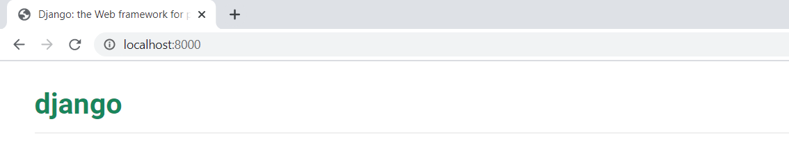
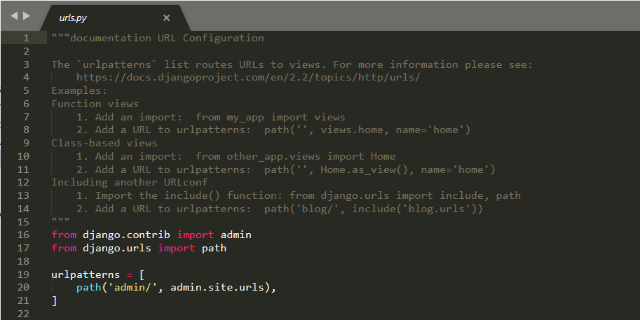
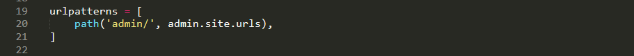
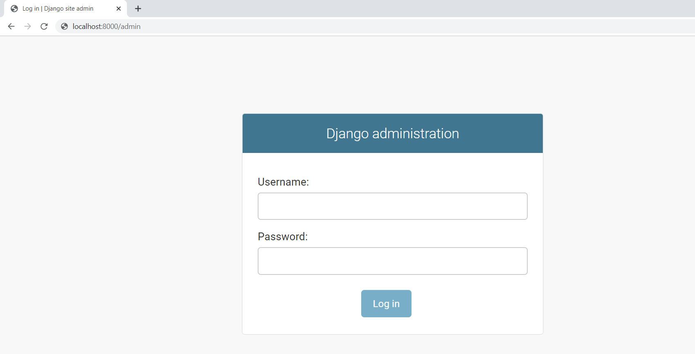
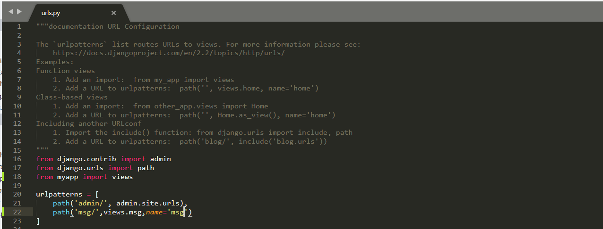
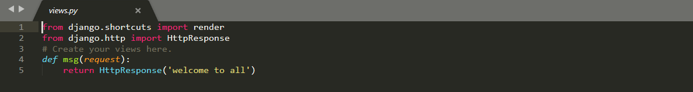
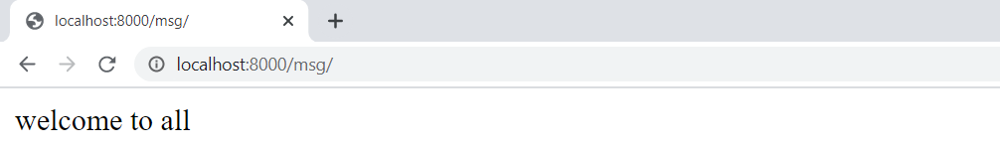

## Django Dynamic Url Creation and  Messages generation
> ### Dynamic Url Creation:
  - #### What is a URL?
    
A URL is a web address. You can see a URL every time you visit a website – it is visible in your browser's address bar.(Yes!     127.0.0.1:8000 is a URL! And localhost:8000 is also a URL! And https://github.com/ is also a URL! )

    

 
Every page on the Internet needs its own URL. This way your application knows what it should show to a user.In Django, we use something called URL configuration.URL configuration is a set of patterns that Django will try to match the requested URL to find the correct view.

  
  - #### How do URLs work in Django?
  
Let's open up the yourproject/urls.py file in your code editor like SublimeTool and see what it looks like:

  
  
  
  
As you can see, Django has already put something here for us.

  
The admin URL, is already here:

  
  
  
This line means that URL that starts with admin/, Django will find a corresponding view.

   
  
  
  - #### Your first Django URL!
  
we can add our first URL pattern:

  -
 in urls.py for creating url we will use path function

  -
 in urls.py ,we have to import views from yourapp for that add this line in urls.py

          - **'from appaname import views'**
          - example: 
                 > 
for example my appname is **myapp** then

                    - **'from myapp import views'** 
  - 
 for that path we will give different values like

          - **path('urlname/',views.funtionname,name='nameoftheurl'),**
          - example: 
                  - **path('msg/',views.msg,name='msg'),**
   -it looks like(urls.py):
   
   - in views.py, we have to import HttpResponse for that add this line in views.py
            **from django.http import HttpResponse**
   -
 in views.py we have add a function with name msg

   def msg(request):
    return HttpResponse('welcome to all')
    
   > in this function, request is a default parameter,we can't change that.
   - it looks like:
   
   
   - save the changes  and start server using **python manage.py runserver**
   - then open chrome **localhost:8000/url**
   - example:
            - **localhost:8000/msg**
   - then we get OUTPUT it looks like:
   
  
       
    
 
