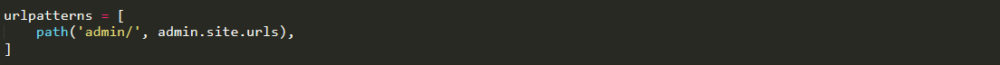

## Django Dynamic Url Creation and  Messages generation
> ### Dynamic Url Creation:
  - #### What is a URL?
    
A URL is a web address. You can see a URL every time you visit a website – it is visible in your browser's address bar.(Yes! 127.0.0.1:8000 is a URL! And localhost:8000 is also a URL! And https://github.com/ is also a URL! )

    

 
Every page on the Internet needs its own URL. This way your application knows what it should show to a user.In Django, we use something called URL configuration.URL configuration is a set of patterns that Django will try to match the requested URL to find the correct view.

  
  - #### How do URLs work in Django?
  
Let's open up the yourproject/urls.py file in your code editor like SublimeTool and see what it looks like:

  
  
  
  
As you can see, Django has already put something here for us.

  
The admin URL, is already here:

  
  
  
This line means that URL that starts with admin/, Django will find a corresponding view.

   
  
